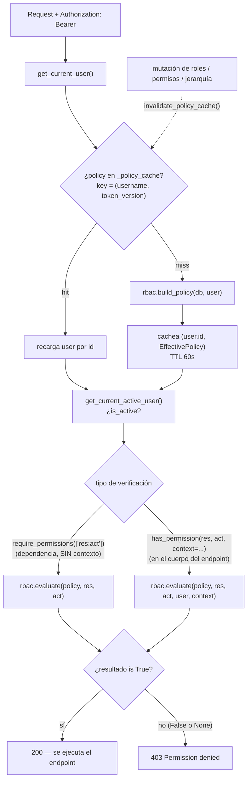
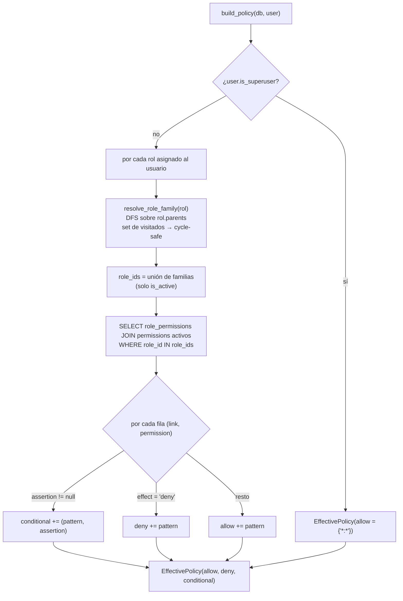
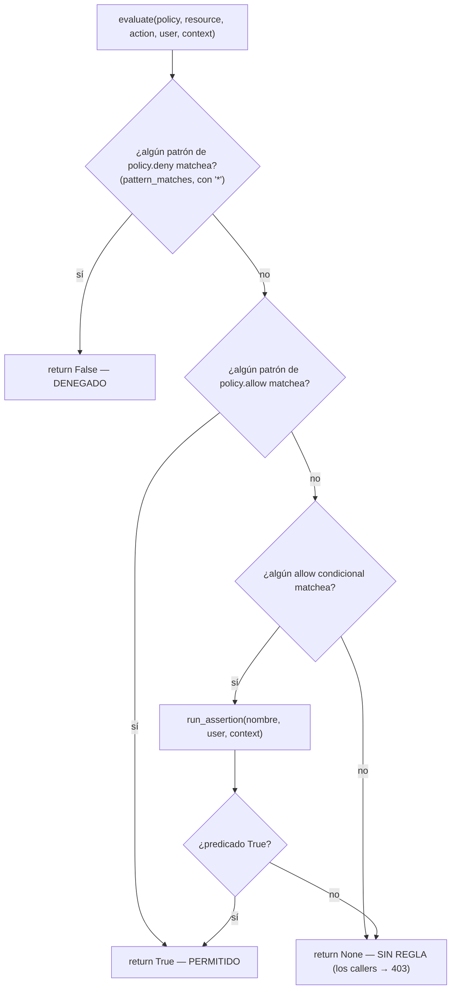
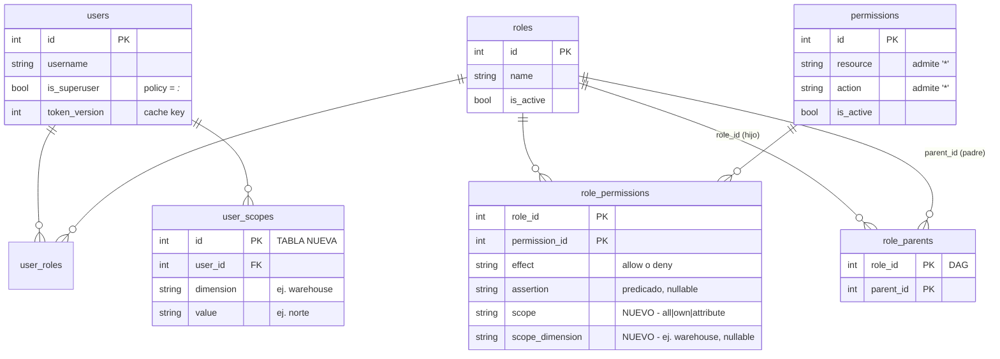
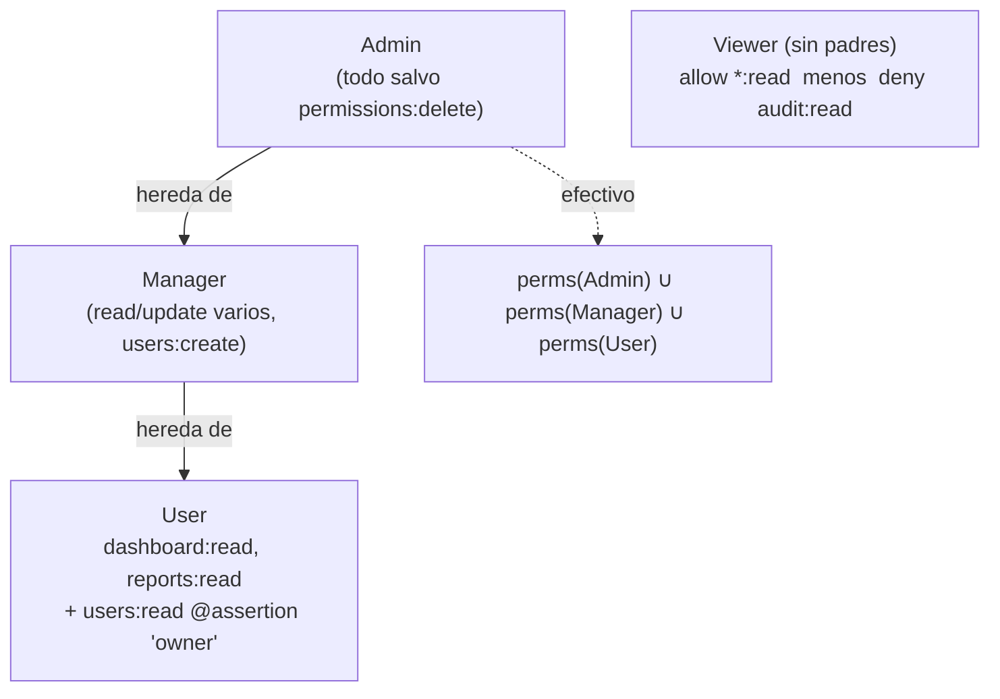

# Guía de Implementación — Template RBAC

Referencia personal para arrancar nuevos proyectos basados en este template. Cubre setup completo, arquitectura de seguridad y los pasos concretos para adaptar el sistema a las reglas de negocio de cada proyecto.

---

## Índice

1. [Qué ofrece este template](#1-qué-ofrece-este-template)
2. [Setup inicial de un nuevo proyecto](#2-setup-inicial-de-un-nuevo-proyecto)
3. [Arquitectura de seguridad](#3-arquitectura-de-seguridad)
4. [Recupero de contraseña](#4-recupero-de-contraseña)
5. [Adaptar el RBAC a un nuevo dominio](#5-adaptar-el-rbac-a-un-nuevo-dominio)
6. [Agregar un nuevo recurso — Backend](#6-agregar-un-nuevo-recurso-protegido)
7. [Agregar un nuevo recurso — Frontend](#7-nueva-página-en-el-frontend)
8. [Variables de entorno y checklist de producción](#8-variables-de-entorno-y-checklist-de-producción)
9. [Limitaciones conocidas y evolución futura](#9-limitaciones-conocidas-y-evolución-futura)
10. [Referencia rápida](#10-referencia-rápida)

---

## 1. Qué ofrece este template

| Capa | Tecnología | Propósito |
|---|---|---|
| Backend | FastAPI + SQLModel | API REST con auth JWT |
| Base de datos | PostgreSQL 17 | Persistencia vía SQLAlchemy ORM |
| Migraciones | Alembic | Control de versiones del schema |
| Frontend | Next.js 15 + TypeScript | SPA con gestión de auth y permisos |
| Estilos | Tailwind CSS v4 | UI con soporte dark/light mode |
| Infraestructura | Docker Compose | Levanta PostgreSQL en local |

**Sistema de permisos RBAC:** `recurso:acción` — granular, con **jerarquía de roles**
(un rol hereda de sus padres), **wildcards** (`users:*`, `*:read`, `*:*`), **reglas DENY**
con precedencia y **resultado ternario** (allow / deny / sin regla). Los superusuarios
reciben el wildcard `*:*` tratado como una regla más, no como bypass especial.

**Flujo de autenticación:** JWT stateless con access token (30 min) + refresh token (7 días). El frontend renueva el access token automáticamente ante un 401.

**Revocación de tokens:** Cada usuario tiene un `token_version` en base de datos. Al hacer logout o cambiar roles, la versión se incrementa e invalida todos los tokens activos inmediatamente.

**Caching de permisos:** Los permisos del usuario se cachean en memoria (TTL 60 s) para evitar consultas a la base de datos en cada request.

**Rate limiting:** Login limitado a 10 req/min por IP; refresh a 30 req/min. Implementado con `slowapi`.

**Auditoría:** Toda operación CRUD queda registrada con usuario, acción, recurso, IP, user-agent, request_id, datos antes/después y resultado (success/failure).

**ABAC vía assertions:** una regla de permiso puede condicionarse a un predicado con
nombre (`owner`, `same_region`, …) evaluado en runtime con el contexto del endpoint
(`has_permission(..., context=...)`).

---

## 2. Setup inicial de un nuevo proyecto

### 2.1 Clonar y renombrar

```bash
git clone <repo> mi-proyecto
cd mi-proyecto

# Iniciar repo limpio (opcional)
rm -rf .git
git init
git add .
git commit -m "chore: init from rbac template"
```

### 2.2 Configurar variables de entorno

```bash
cp backend/.env.example backend/.env
```

Editar `backend/.env` con los valores del nuevo proyecto:

```env
PROJECT_NAME=Mi Proyecto
VERSION=1.0.0

# Generar con: python -c "import secrets; print(secrets.token_hex(32))"
SECRET_KEY=<clave-aleatoria-de-64-chars>

ACCESS_TOKEN_EXPIRE_MINUTES=30
REFRESH_TOKEN_EXPIRE_DAYS=7

POSTGRES_SERVER=localhost
POSTGRES_USER=mi_proyecto_user
POSTGRES_PASSWORD=<password-seguro>
POSTGRES_DB=mi_proyecto_db
POSTGRES_PORT=5432

BACKEND_CORS_ORIGINS=["http://localhost:3000"]

# Rate limiting (ajustar según necesidad)
RATE_LIMIT_LOGIN=10/minute
RATE_LIMIT_REFRESH=30/minute
```

Crear `frontend/.env.local`:

```env
NEXT_PUBLIC_API_URL=http://localhost:8000/api/v1
```

### 2.3 Levantar la base de datos

```bash
docker compose up -d
docker compose ps
```

### 2.4 Backend

```bash
cd backend
python3 -m venv venv
source venv/bin/activate
pip install -r requirements.txt

# Crear tablas e inicializar datos semilla
python -c "from app.db.init_db import create_tables, init_db; create_tables(); init_db()"

uvicorn app.main:app --reload --host 0.0.0.0 --port 8000
```

API disponible en: `http://localhost:8000/docs`

### 2.5 Frontend

```bash
cd frontend
npm install
npm run dev
```

App disponible en: `http://localhost:3000`

### 2.6 Usuarios de prueba por defecto

| Usuario | Contraseña | Rol | Superuser |
|---|---|---|---|
| superadmin | admin123 | Super Admin | Sí |
| admin | admin123 | Admin | No |
| manager | manager123 | Manager | No |
| user | user123 | User | No |

> **Cambiar estas contraseñas antes de cualquier deploy.**

---

## 3. Arquitectura de seguridad

### 3.1 Diagrama de flujo de autenticación completo

```
[Login]
  │
  ▼
POST /api/v1/auth/login (form-urlencoded: username + password)
  │   ← rate limited: 10/min por IP
  ├── Backend valida con bcrypt
  ├── Genera access_token  (HS256, 30 min, claims: sub, token_version, type="access")
  └── Genera refresh_token (HS256, 7 días, claims: sub, token_version, type="refresh")
        │
        ▼
  Frontend guarda ambos tokens
  Access token se envía en cada request: Authorization: Bearer <token>

[Request protegido]
  │
  ▼
  HTTPBearer extrae el token del header
  verify_token()       → valida firma, expiración y claim type="access"
  get_current_user()   → busca usuario por sub (username)
                         verifica token_version del JWT == token_version en DB
                         (si difieren → 401: token revocado)
  get_current_active_user() → verifica is_active=True
  require_permissions() → EffectivePolicy del cache (TTL 60 s) o build_policy()
                          superuser → allow {"*:*"}
                          regular   → reglas de la familia de roles (directos + ancestros)
                          evaluate(): deny match → 403 · allow match (incl. wildcard) → OK
                                      sin regla / sólo allow condicional sin contexto → 403

[Token expirado (401)]
  │
  ▼
  Frontend intercepta el 401
  POST /api/v1/auth/refresh  ← rate limited: 30/min por IP
  body JSON: {"refresh_token": "..."}
        │
        ├── Refresh válido + token_version coincide → nuevo access + refresh → reintenta
        └── Refresh inválido o token_version no coincide → logout automático

[Logout / Revocación]
  │
  ▼
POST /api/v1/auth/logout (requiere Bearer)
  │
  └── user.token_version += 1 (DB)
      Todos los tokens existentes (access + refresh) quedan inválidos inmediatamente
      Próximo request con token viejo → 401 (token_version no coincide)

[Cambio de roles]
  └── assign_roles_to_user() → token_version += 1 automáticamente
      El usuario recibe permisos nuevos en el próximo login/refresh
```

### 3.2 Cómo funciona `require_permissions()` — implementación real

Archivos: `backend/app/core/rbac.py` (motor de decisión, sin FastAPI) y
`backend/app/core/deps.py` (dependencias FastAPI).

El motor separa la **política efectiva** del usuario (todas sus reglas, ya resueltas
sobre la jerarquía de roles) de la **evaluación** de un permiso concreto:

```python
# backend/app/core/rbac.py

@dataclass
class EffectivePolicy:
    allow: set[str]                       # patrones "resource:action" (con * opcional)
    deny: set[str]                        # una regla deny gana SIEMPRE
    conditional: list[tuple[str, str]]    # (patrón, nombre de assertion) → allow condicional

def build_policy(db, user) -> EffectivePolicy:
    """Superuser → allow {"*:*"}. Resto: recorre la familia de roles del usuario
    (directos + heredados) y junta las filas role_permissions activas."""

def evaluate(policy, resource, action, *, user=None, context=None) -> bool | None:
    # 1) si matchea algún patrón de deny  → False   (inmediato)
    # 2) si matchea algún patrón de allow → True
    # 3) si matchea un allow condicional y su assertion pasa → True
    # 4) si nada matchea → None   (resultado ternario)
```

```python
# backend/app/core/deps.py

def require_permissions(required_permissions: List[str]):
    def permission_checker(
        current_user: User = Depends(get_current_active_user),
        db: Session = Depends(get_db),
    ):
        policy = rbac.get_cached_policy(db, current_user)   # cache TTL 60s
        for required in required_permissions:
            resource, _, action = required.partition(":")
            if rbac.evaluate(policy, resource, action) is not True:
                raise HTTPException(403, detail=f"Permission denied. Required: {required}")
        return current_user
    return permission_checker
```

`require_permissions()` evalúa **sin contexto**: las reglas con `assertion` no otorgan
acceso por esta vía. Para permisos condicionados por atributos del recurso, usar
`has_permission()` dentro del endpoint (ver 3.8).

**Flujo completo de un request protegido:**



**`build_policy()` — cómo se arma la política efectiva:**



**`evaluate()` — decisión ternaria (DENY primero, gana siempre):**



`pattern_matches(pattern, resource, action)` → `pr in (resource, "*") and pa in (action, "*")`,
lo que habilita los comodines `users:*`, `*:read` y `*:*`.

**Uso en un endpoint:**
```python
@router.get("/productos")
def listar_productos(
    current_user: User = Depends(require_permissions(["productos:read"]))
):
    ...
```

**Helpers predefinidos:**
```python
def require_user_read():
    return require_permissions(["users:read"])
```

### 3.3 Tokens JWT — estructura de claims

```python
# Access token — expira en ACCESS_TOKEN_EXPIRE_MINUTES
{
    "sub": "username",
    "token_version": 3,   # debe coincidir con user.token_version en DB
    "type": "access",
    "exp": <timestamp>
}

# Refresh token — expira en REFRESH_TOKEN_EXPIRE_DAYS
{
    "sub": "username",
    "token_version": 3,
    "type": "refresh",
    "exp": <timestamp>
}
```

`verify_token()` rechaza tokens con `type != "access"`.
`verify_refresh_token()` rechaza tokens con `type != "refresh"`.
Ambos rechazan si `token_version` del token no coincide con el valor en DB.

### 3.4 Revocación de tokens mediante `token_version`

El campo `token_version: int` en el modelo `User` actúa como versión de sesión. Cada vez que se incrementa, todos los tokens JWT anteriores quedan inválidos sin necesidad de blacklist ni Redis.

| Evento | Efecto sobre `token_version` |
|---|---|
| `POST /auth/logout` | +1 (logout explícito) |
| `PUT /users/{id}/roles` (asignar roles) | +1 (permisos cambiaron) |
| `PUT /users/{id}` con `is_active=false` | +1 (cuenta desactivada) |

**Trade-off:** Este enfoque invalida todos los tokens del usuario a la vez (no permite sesiones concurrentes independientes). Para tokens con granularidad por sesión se necesitaría un almacén externo (Redis).

### 3.5 Cache de políticas en memoria

```python
# backend/app/core/rbac.py
_policy_cache: TTLCache = TTLCache(maxsize=512, ttl=60)   # value = (user_id, EffectivePolicy)
```

- **Clave:** `(username, token_version)` — se invalida automáticamente cuando el token_version cambia.
- **TTL:** 60 segundos. Un cambio de roles/permisos/jerarquía tarda hasta 60 s en reflejarse para sesiones activas.
- **Tamaño máximo:** 512 entradas (ajustar según cantidad de usuarios concurrentes esperados).
- **Invalidación explícita:** `rbac.invalidate_policy_cache()` limpia el cache del proceso.
  Lo llaman los servicios que mutan el grafo (`assign_permissions_to_role`,
  `assign_parents_to_role`, `update_role` con `is_active`, `delete_permission`).
  En despliegues multi-worker cada proceso tiene su cache; el TTL de 60 s es el backstop.

### 3.6 Manejo de refresh concurrente — Frontend

Archivo: `frontend/lib/api/client.ts`

Si múltiples requests reciben 401 simultáneamente, el cliente serializa el refresh:

```typescript
// Solo un intento de refresh a la vez; el resto espera la misma promesa
if (this.isRefreshing && this.refreshPromise) {
    return this.refreshPromise;
}
```

Una vez obtenido el nuevo token, todos los requests reintentados lo usan.

### 3.7 Modelo de permisos RBAC

```
Usuario → (N roles activos + roles ancestros) → (N reglas de permiso)

Regla de permiso = permiso { resource, action }  +  effect (allow|deny)  +  assertion?
                   +  scope (all|own|attribute) [+ scope_dimension]
```

**Modelo de datos** (columnas/tablas nuevas marcadas):



**Acciones estándar:** `create`, `read`, `update`, `delete`, `export`

Los permisos se heredan de **todos** los roles activos del usuario y de los
**roles ancestros** de cada uno (ver 3.11). Si un permiso está en cualquier rol de esa
familia, el usuario lo tiene — salvo que una regla `deny` lo bloquee.

**Wildcards de recurso:** un permiso puede usar `*` como comodín en el recurso o la
acción. Los patrones se comparan con `pattern_matches()`:

| Patrón del permiso | Concede |
|---|---|
| `users:read` | exactamente `users:read` |
| `users:*` | cualquier acción sobre `users` |
| `*:read` | `read` sobre cualquier recurso |
| `*:*` | todo (es el que recibe el superusuario) |

**Reglas DENY:** cada fila `role_permissions` tiene un campo `effect` (`"allow"` por
defecto | `"deny"`). Una regla `deny` que matchee gana **siempre**, aunque otro rol
(o un wildcard) conceda el permiso. Sirve para "este rol puede todo en `reports` salvo
`delete`".

**Resultado ternario:** `evaluate()` devuelve `True` (permitido), `False` (denegado
explícitamente) o `None` (ninguna regla aplica). `require_permissions()` trata `None`
como denegación.

**Superusuario:** en lugar de un bypass especial (`if is_superuser: return True`), se le
asigna el wildcard `{"*:*"}` como política. `evaluate()` lo trata como cualquier otra
regla, evitando lógica especial dispersa en el código.

### 3.8 ABAC — Control basado en atributos del recurso

El RBAC puro (`recurso:acción`) no distingue atributos del recurso: "puede leer sus
propios pedidos vs los de otros", "sólo los de su región", "sólo si está en borrador".
Para esos casos, una regla de permiso puede referenciar una **assertion**: un predicado
con nombre `fn(user, context) -> bool` que se evalúa en runtime.

**1. Registrar la assertion** (`backend/app/core/assertions.py`):

```python
from app.core.assertions import register_assertion

@register_assertion("owner")            # ya viene incluida
def _owner(user, context):
    owner_id = context.get("resource_owner_id")
    return owner_id is not None and owner_id == user.id

@register_assertion("same_region")      # ejemplo de dominio
def _same_region(user, context):
    return user.region and user.region == context.get("region")
```

**2. Vincular la assertion a un permiso de un rol** — al asignar permisos al rol se pasa
`assertion` en la regla (endpoint `POST /roles/{id}/permissions` con `rules`):

```json
{ "role_id": 4, "rules": [ { "permission_id": 12, "assertion": "owner" } ] }
```

**3. Evaluar en el endpoint** con `has_permission()`, pasando el `context`:

```python
from app.core.deps import has_permission

@router.get("/{pedido_id}", response_model=PedidoRead)
def get_pedido(pedido_id: int, db: Session = Depends(get_db),
               current_user: User = Depends(get_current_active_user)):
    pedido = pedido_service.get(db, pedido_id)
    if pedido is None:
        raise HTTPException(404)
    allowed = has_permission(
        current_user, "pedidos", "read", db=db,
        context={"resource_owner_id": pedido.owner_id, "region": pedido.region},
    )
    if not allowed:
        raise HTTPException(403, "Permission denied")
    return pedido
```

`has_permission()` corre la evaluación completa (wildcards + deny + assertions). Un rol
con `pedidos:read` incondicional pasa siempre; uno con `pedidos:read` + assertion `owner`
pasa sólo para sus propios pedidos.

> `check_owner_or_permission()` queda como shim deprecado sobre `has_permission()`.
> `require_owner_or_permission()` fue eliminado (no tenía uso).

### 3.8b Alcance de datos — "¿sobre qué filas?" (data scoping)

Las assertions responden "¿puede?" fila por fila, pero no filtran un **listado** ni son
configurables como dato. Para "el administrador de sistemas ve todos los pedidos, el
vendedor sólo los suyos, el jefe de depósito sólo los de su depósito", cada regla
`role_permissions` lleva además un **`scope`** que el admin elige al parametrizar el
permiso:

| `scope` | Filas que concede | Requiere |
|---|---|---|
| `all` (default) | todas | — |
| `own` | las del usuario (`Model.owner_id == user.id`) | columna de propiedad en el modelo |
| `attribute` | las que matchean los valores del usuario en `scope_dimension` | `scope_dimension` (ej. `warehouse`) + filas en `user_scopes` + columna homónima en el modelo |

`own` y `attribute` de un mismo `resource:action` se combinan como **OR**; una regla
`deny` sigue ganando; un `allow` plano (o el `*:*` del superusuario) da acceso total.

**Convención:** la columna del modelo se llama igual que la dimensión
(`scope_dimension="warehouse"` → `Model.warehouse`). El atributo de propiedad es
`owner_id` por defecto (`owner_attr=` para cambiarlo).

**1. Valores del usuario** (`user_scopes`), vía API:

```json
PUT /api/v1/users/7/scopes
{ "items": [ { "dimension": "warehouse", "value": "norte" } ] }
```

**2. Regla del rol** con `scope` (endpoint `POST /roles/{id}/permissions`):

```json
{ "role_id": 4, "rules": [
  { "permission_id": 12, "scope": "own" },
  { "permission_id": 12, "scope": "attribute", "scope_dimension": "warehouse" }
] }
```

**3. Endpoint** con la dependencia `require_scope(resource, action)` — devuelve
`ScopedAccess(user, scope)`; 403 sólo si hay `deny` o ninguna regla:

```python
from app.core.deps import require_scope, ScopedAccess

@router.get("/", response_model=PaginatedResponse[OrderRead])
def list_orders(db: Session = Depends(get_db),
                access: ScopedAccess = Depends(require_scope("orders", "read"))):
    total = order_service.count(db, access.scope)                 # scope.apply() en el WHERE
    items = order_service.list(db, access.scope, skip=0, limit=10)
    ...

@router.get("/{oid}", response_model=OrderRead)
def get_order(oid: int, db: Session = Depends(get_db),
              access: ScopedAccess = Depends(require_scope("orders", "read"))):
    order = order_service.get(db, oid)
    if order is None or not access.scope.matches(order):          # chequeo objeto
        raise HTTPException(404)
    return order
```

El servicio hace `stmt = scope.apply(select(Order), Order)` antes de `offset/limit` y del
`func.count`, así la paginación (`total`) queda coherente. Motor: `rbac.resolve_scope()`
+ la dataclass `rbac.Scope`. Modelo de referencia completo: `app/api/orders.py`,
`Order` en `app/models/models.py`, `OrderService` en `app/services/crud.py`. Tests:
`backend/tests/test_scoping.py`.

### 3.9 Rate limiting

Configurado en `backend/app/core/limiter.py` con `slowapi`:

```python
limiter = Limiter(key_func=get_remote_address)
```

Y aplicado como decorador en los endpoints sensibles:

```python
@router.post("/login")
@limiter.limit(settings.RATE_LIMIT_LOGIN)   # default: "10/minute"
async def login(request: Request, ...):
    ...
```

Para agregar rate limiting a un endpoint propio:
```python
from app.core.limiter import limiter
from app.core.config import settings

@router.post("/mi-endpoint")
@limiter.limit("5/minute")
async def mi_endpoint(request: Request, ...):
    ...
```

### 3.10 Registro de auditoría

Campos registrados en cada evento:

| Campo | Descripción |
|---|---|
| `user_id`, `username` | Actor (quien ejecuta la acción) |
| `subject_id` | Sujeto (usuario afectado, si aplica) |
| `action` | `create`, `update`, `delete`, `login`, `logout`, `password_change`, etc. |
| `resource`, `resource_id` | Recurso afectado |
| `before_data`, `after_data` | JSON con estado antes/después (diff) |
| `status` | `success` o `failure` |
| `ip_address`, `user_agent` | Contexto de red |
| `request_id` | UUID por request para tracing |
| `timestamp` | UTC automático |

**Uso en un endpoint:**

```python
from app.services.audit_service import audit_service

# Éxito
audit_service.log(
    db=db,
    action="create",
    resource="pedidos",
    resource_id=pedido.id,
    user_id=current_user.id,
    username=current_user.username,
    subject_id=pedido.owner_id,        # opcional: usuario afectado
    before_data=None,
    after_data=json.dumps({"total": pedido.total}),
    ip=request.client.host,
    request_id=getattr(request.state, "request_id", None),
    user_agent=request.headers.get("user-agent"),
)

# Fallo (login incorrecto, permiso denegado, etc.)
audit_service.log_failure(
    db=db,
    action="login",
    resource="auth",
    details="Failed login attempt for username: unknown",
    ip=ip,
    request_id=rid,
    user_agent=ua,
)
```

Los logs son consultables vía `GET /api/v1/audit/logs` (requiere permiso `audit:read`).

### 3.11 Jerarquía de roles

Un rol puede heredar de **varios** roles padre (DAG multi-padre). Tabla `role_parents`
(`role_id`, `parent_id`). La política efectiva de un usuario resuelve, para cada rol
asignado, toda su familia de ancestros (`rbac.resolve_role_family`, cycle-safe).

**Jerarquía y reglas del seed por defecto:**



**Gestión vía API:**

```
POST /api/v1/roles/{role_id}/parents          # body: { role_id, parent_ids: [int] }
GET  /api/v1/roles/{role_id}/effective-permissions   # allow / deny / conditional resueltos
```

**Reglas:**

- No se permite auto-referencia ni ciclos: `assign_parents_to_role` valida contra los
  ancestros del padre propuesto y devuelve **400** si detecta un ciclo.
- Un `deny` heredado de un ancestro también bloquea al rol hijo.
- Borrar un rol elimina en cascada sus filas de `role_parents`.

**Cache e invalidación:** la política efectiva se cachea por `(username, token_version)`
con TTL 60 s. Los servicios que mutan el grafo (asignar permisos/padres, activar o
desactivar un rol, borrar permisos) llaman `rbac.invalidate_policy_cache()`, que limpia
el cache del proceso. En despliegues **multi-worker** cada proceso tiene su propio cache;
el TTL de 60 s es el límite superior de propagación entre workers.

---

## 4. Recupero de contraseña

### 4.1 Diseño de seguridad

| Decisión | Implementación |
|---|---|
| Generación del token | `secrets.token_urlsafe(32)` — 256 bits de entropía |
| Almacenamiento | Hash SHA-256 en DB (`password_reset_tokens.token_hash`) — nunca el token crudo |
| Expiración | 30 minutos (configurable con `RESET_TOKEN_EXPIRE_MINUTES`) |
| Uso único | `used=True` + `used_at` al consumirlo; tokens usados no se aceptan |
| Invalidación previa | Al crear un token nuevo, los pendientes del mismo usuario se eliminan |
| Anti-enumeración | Siempre se retorna la misma respuesta genérica, exista o no el usuario |
| Envío de email | `BackgroundTask` — el endpoint responde inmediatamente sin esperar el SMTP |
| Rate limiting | `/request`: 5/hour · `/confirm`: 10/hour (ambos por IP) |
| JWT invalidation | `token_version += 1` tras reset exitoso → todos los tokens activos quedan inválidos |
| Auditoría | `password_reset_request` y `password_reset_confirm` en `audit_logs` |

### 4.2 Flujo completo

```
[Usuario en /login]
  └── click "¿Olvidaste tu contraseña?" → /forgot-password

[/forgot-password]
  └── POST /api/v1/auth/password-reset/request
      body: {"identifier": "email@ejemplo.com"}  ← acepta email o username
      rate limited: 5/hour por IP
        │
        ├── Usuario no encontrado / inactivo → respuesta genérica (no revela nada)
        └── Usuario encontrado:
              1. Invalida tokens pendientes anteriores
              2. Genera raw_token = secrets.token_urlsafe(32)
              3. Guarda SHA-256(raw_token) en password_reset_tokens
              4. Envía email en background → link: {FRONTEND_URL}/reset-password?token={raw_token}
              5. Retorna respuesta genérica
              6. Registra en audit_logs

[Email recibido → /reset-password?token=<raw_token>]
  └── POST /api/v1/auth/password-reset/confirm
      body: {"token": "<raw_token>", "new_password": "nueva123"}
      rate limited: 10/hour por IP
        │
        ├── SHA-256(token) no encontrado, used=True, o expirado → 400
        └── Token válido:
              1. token.used = True + token.used_at = now()
              2. user.hashed_password = bcrypt(nueva_contraseña)
              3. user.token_version += 1 (invalida todos los JWT activos)
              4. Retorna 200 con mensaje de éxito
              5. Registra en audit_logs
```

### 4.3 Tabla `password_reset_tokens`

| Campo | Tipo | Descripción |
|---|---|---|
| `id` | int PK | — |
| `user_id` | int FK → users(CASCADE) | Propietario del token |
| `token_hash` | str (indexed) | SHA-256 del token enviado por email |
| `expires_at` | datetime tz | Momento de expiración |
| `used` | bool | `True` si ya fue consumido |
| `used_at` | datetime tz | Cuándo fue usado |
| `ip_requested` | str | IP que solicitó el reset |
| `created_at` | datetime tz | Creación automática |

### 4.4 Configurar SMTP en `.env`

```env
# SMTP corporativo
SMTP_HOST=mail.empresa.com
SMTP_PORT=587
SMTP_TLS=true
SMTP_USER=noreply@empresa.com
SMTP_PASSWORD=<password-smtp>
SMTP_FROM=noreply@empresa.com
SMTP_FROM_NAME=Mi Proyecto

# Password reset
RESET_TOKEN_EXPIRE_MINUTES=30
FRONTEND_URL=https://mi-dominio.com
```

Para SMTP sin autenticación (relay interno):
```env
SMTP_HOST=relay.interno.empresa.com
SMTP_PORT=25
SMTP_TLS=false
# SMTP_USER y SMTP_PASSWORD se omiten
```

### 4.5 Migración de base de datos

Al usar el template por primera vez o al actualizar desde una versión anterior:

```bash
cd backend
source venv/bin/activate
alembic upgrade head
```

La migración `e4f5a6b7c8d9` crea la tabla `password_reset_tokens`.

### 4.6 Nuevos endpoints

| Método | Endpoint | Autenticación | Rate limit |
|---|---|---|---|
| POST | `/api/v1/auth/password-reset/request` | No requerida | 5/hour por IP |
| POST | `/api/v1/auth/password-reset/confirm` | No requerida | 10/hour por IP |

### 4.7 Páginas del frontend

| Ruta | Descripción |
|---|---|
| `/forgot-password` | Formulario para solicitar el reset (acepta email o username) |
| `/reset-password?token=<token>` | Formulario para ingresar la nueva contraseña |
| `/login` | Ahora incluye link "¿Olvidaste tu contraseña?" |

### 4.8 Archivos relevantes

```
backend/app/
  models/models.py              → PasswordResetToken (tabla)
  schemas/schemas.py            → PasswordResetRequest, PasswordResetConfirm
  services/password_reset_service.py → create_token, get_valid_token, use_token
  services/email_service.py     → send_password_reset (SMTP)
  api/password_reset.py         → POST /auth/password-reset/request y /confirm
  core/config.py                → SMTP_*, RESET_TOKEN_EXPIRE_MINUTES, FRONTEND_URL

frontend/app/
  forgot-password/page.tsx      → página de solicitud
  reset-password/page.tsx       → página de confirmación (lee ?token de URL)
frontend/lib/api/services.ts    → authService.requestPasswordReset / confirmPasswordReset
```

---

## 5. Adaptar el RBAC a un nuevo dominio

### 5.1 Definir los recursos del proyecto

Antes de tocar código, mapear los recursos y acciones propios del dominio:

```
# Ejemplo: sistema de gestión de inventario
recursos:
  - productos:   create, read, update, delete, export
  - categorias:  create, read, update, delete
  - proveedores: create, read, update, delete
  - inventario:  read, update, export
  - reportes:    read, export

# Más los recursos base del template (siempre necesarios):
  - users, roles, permissions: create, read, update, delete
  - dashboard: read
  - audit: read
  - settings: read, update
```

### 5.2 Editar `init_db.py`

Archivo: `backend/app/db/init_db.py`

Reemplazar la lista `permissions_data` con los permisos del nuevo dominio:

```python
permissions_data = [
    # Permisos base (mantener siempre)
    {"name": "users:create", "resource": "users", "action": "create", "description": "Crear usuarios"},
    {"name": "users:read",   "resource": "users", "action": "read",   "description": "Ver usuarios"},
    # ... resto de users, roles, permissions, dashboard, audit, settings

    # Permisos del dominio específico
    {"name": "productos:create", "resource": "productos", "action": "create", "description": "Crear productos"},
    {"name": "productos:read",   "resource": "productos", "action": "read",   "description": "Ver productos"},
    {"name": "productos:update", "resource": "productos", "action": "update", "description": "Editar productos"},
    {"name": "productos:delete", "resource": "productos", "action": "delete", "description": "Eliminar productos"},
    {"name": "productos:export", "resource": "productos", "action": "export", "description": "Exportar productos"},
]
```

### 5.3 Definir roles y asignar permisos

En la misma función `init_db()`, ajustar los roles y sus permisos:

```python
roles_data = [
    {"name": "Super Admin",    "description": "Acceso total al sistema"},
    {"name": "Administrador",  "description": "Administración completa excepto eliminación de permisos"},
    {"name": "Supervisor",     "description": "Gestión operativa"},
    {"name": "Operador",       "description": "Carga y consulta de datos"},
    {"name": "Consultor",      "description": "Solo lectura"},
]

admin = next(r for r in roles if r.name == "Administrador")
admin.permissions = [p for p in permissions if p.name not in ["permissions:delete"]]

supervisor = next(r for r in roles if r.name == "Supervisor")
supervisor.permissions = [p for p in permissions
    if p.action in ["read", "update"]
    or (p.resource == "productos" and p.action == "create")]
```

**Jerarquía, wildcards, DENY y assertions en el seed:**

```python
# Herencia: Supervisor hereda todo lo de Operador
supervisor.parents = [operador]

# Wildcard: un permiso "*:read" concede lectura de cualquier recurso
consultor.permissions = [by_name["*:read"]]

# DENY: Consultor NO puede leer auditoría pese al wildcard
_ensure_link(db, consultor.id, by_name["audit:read"].id, effect="deny")

# Assertion: Operador sólo edita los productos que creó
_ensure_link(db, operador.id, by_name["productos:update"].id, assertion="owner")

# Scope: Operador sólo ve sus productos; Supervisor sólo los de su sucursal
_ensure_link(db, operador.id, by_name["productos:read"].id, scope="own")
_ensure_link(db, supervisor.id, by_name["productos:read"].id,
             scope="attribute", scope_dimension="sucursal")
```

`_ensure_link(db, role_id, permission_id, *, effect="allow", assertion=None,
scope="all", scope_dimension=None)` es un helper idempotente de `init_db.py` para crear
filas `role_permissions` (las asignaciones por lista `role.permissions = [...]` siempre
son `allow`, sin assertion, `scope="all"`). Para `scope="attribute"` hay que además
sembrar filas en `user_scopes` (`UserScope(user_id=..., dimension="sucursal", value=...)`).

### 5.4 Agregar helpers de permisos en `deps.py`

```python
# backend/app/core/deps.py

def require_producto_read():
    return require_permissions(["productos:read"])

def require_producto_create():
    return require_permissions(["productos:create"])

def require_producto_update():
    return require_permissions(["productos:update"])

def require_producto_delete():
    return require_permissions(["productos:delete"])
```

---

## 6. Agregar un nuevo recurso protegido

Checklist completo para agregar, por ejemplo, un recurso `Producto`.

### 6.1 Modelo ORM

`backend/app/models/models.py`

```python
class Producto(SQLModel, table=True):
    __tablename__ = "productos"

    id: Optional[int] = Field(default=None, primary_key=True)
    nombre: str = Field(index=True)
    descripcion: Optional[str] = None
    precio: float
    owner_id: Optional[int] = Field(
        default=None,
        sa_column=Column(Integer, ForeignKey("users.id", ondelete="SET NULL"), nullable=True),
    )
    is_active: bool = Field(default=True)
    created_at: Optional[datetime] = Field(
        default=None,
        sa_column=Column(DateTime(timezone=True), server_default=func.now()),
    )
    updated_at: Optional[datetime] = Field(
        default=None,
        sa_column=Column(DateTime(timezone=True), onupdate=func.now(), nullable=True),
    )
```

> Incluir `owner_id` si el recurso tiene concept de propietario (necesario para ABAC).

### 6.2 Schemas Pydantic

`backend/app/schemas/schemas.py`

```python
class ProductoCreate(SQLModel):
    nombre: str
    descripcion: Optional[str] = None
    precio: float

class ProductoUpdate(SQLModel):
    nombre: Optional[str] = None
    descripcion: Optional[str] = None
    precio: Optional[float] = None
    is_active: Optional[bool] = None

class ProductoRead(SQLModel):
    id: int
    nombre: str
    descripcion: Optional[str]
    precio: float
    owner_id: Optional[int]
    is_active: bool
    created_at: Optional[datetime]
```

### 6.3 Servicio CRUD

`backend/app/services/crud.py`

```python
class ProductoService:
    def get(self, db: Session, id: int) -> Optional[Producto]:
        return db.get(Producto, id)

    def get_all(self, db: Session, skip: int = 0, limit: int = 100) -> List[Producto]:
        return db.exec(select(Producto).offset(skip).limit(limit)).all()

    def create(self, db: Session, data: ProductoCreate, owner_id: Optional[int] = None) -> Producto:
        producto = Producto(**data.model_dump(), owner_id=owner_id)
        db.add(producto)
        db.commit()
        db.refresh(producto)
        return producto

    def update(self, db: Session, id: int, data: ProductoUpdate) -> Optional[Producto]:
        producto = self.get(db, id)
        if not producto:
            return None
        for key, value in data.model_dump(exclude_unset=True).items():
            setattr(producto, key, value)
        db.commit()
        db.refresh(producto)
        return producto

    def delete(self, db: Session, id: int) -> bool:
        producto = self.get(db, id)
        if not producto:
            return False
        db.delete(producto)
        db.commit()
        return True

producto_service = ProductoService()
```

### 6.4 Endpoint con permisos, ABAC y auditoría

`backend/app/api/productos.py`

```python
import json
from fastapi import APIRouter, Depends, HTTPException, Request
from sqlmodel import Session
from app.db.database import get_db
from app.core.deps import require_permissions, get_current_active_user, has_permission
from app.models.models import User
from app.services.crud import producto_service
from app.services.audit_service import audit_service
from app.schemas.schemas import ProductoCreate, ProductoRead, ProductoUpdate

router = APIRouter(prefix="/productos", tags=["productos"])


def _meta(request: Request):
    return (
        getattr(request.state, "request_id", None),
        request.headers.get("user-agent"),
        request.client.host if request.client else None,
    )


@router.get("/", response_model=list[ProductoRead])
def listar_productos(
    db: Session = Depends(get_db),
    current_user: User = Depends(require_permissions(["productos:read"])),
):
    return producto_service.get_all(db)


@router.get("/{producto_id}", response_model=ProductoRead)
def get_producto(
    producto_id: int,
    db: Session = Depends(get_db),
    current_user: User = Depends(get_current_active_user),
):
    producto = producto_service.get(db, producto_id)
    if not producto:
        raise HTTPException(404, "Producto no encontrado")
    # ABAC: permiso "productos:read" (incondicional o assertion "owner" con este contexto)
    if not has_permission(current_user, "productos", "read", db=db,
                          context={"resource_owner_id": producto.owner_id}):
        raise HTTPException(403, "Permission denied")
    return producto


@router.post("/", response_model=ProductoRead, status_code=201)
def crear_producto(
    data: ProductoCreate,
    request: Request,
    db: Session = Depends(get_db),
    current_user: User = Depends(require_permissions(["productos:create"])),
):
    rid, ua, ip = _meta(request)
    producto = producto_service.create(db, data, owner_id=current_user.id)
    audit_service.log(db, action="create", resource="productos", resource_id=producto.id,
                      user_id=current_user.id, username=current_user.username,
                      after_data=json.dumps({"nombre": producto.nombre}),
                      ip=ip, request_id=rid, user_agent=ua)
    return producto


@router.put("/{producto_id}", response_model=ProductoRead)
def actualizar_producto(
    producto_id: int,
    data: ProductoUpdate,
    request: Request,
    db: Session = Depends(get_db),
    current_user: User = Depends(get_current_active_user),
):
    rid, ua, ip = _meta(request)
    producto = producto_service.get(db, producto_id)
    if not producto:
        raise HTTPException(404, "Producto no encontrado")
    if not has_permission(current_user, "productos", "update", db=db,
                          context={"resource_owner_id": producto.owner_id}):
        raise HTTPException(403, "Permission denied")
    before = json.dumps({"nombre": producto.nombre, "precio": producto.precio})
    result = producto_service.update(db, producto_id, data)
    audit_service.log(db, action="update", resource="productos", resource_id=producto_id,
                      user_id=current_user.id, username=current_user.username,
                      before_data=before,
                      after_data=json.dumps(data.model_dump(exclude_unset=True)),
                      ip=ip, request_id=rid, user_agent=ua)
    return result


@router.delete("/{producto_id}", status_code=204)
def eliminar_producto(
    producto_id: int,
    request: Request,
    db: Session = Depends(get_db),
    current_user: User = Depends(require_permissions(["productos:delete"])),
):
    rid, ua, ip = _meta(request)
    producto = producto_service.get(db, producto_id)
    before = json.dumps({"nombre": producto.nombre if producto else None})
    if not producto_service.delete(db, producto_id):
        raise HTTPException(404, "Producto no encontrado")
    audit_service.log(db, action="delete", resource="productos", resource_id=producto_id,
                      user_id=current_user.id, username=current_user.username,
                      before_data=before, ip=ip, request_id=rid, user_agent=ua)
```

### 6.5 Registrar el router

`backend/app/api/__init__.py`

```python
from app.api import productos

api_router.include_router(productos.router, prefix=settings.API_V1_STR)
```

### 6.6 Actualizar la lista de recursos disponibles

El endpoint `/permissions/resources/available` tiene los recursos hardcodeados. Al agregar un recurso nuevo, actualizarlo en `backend/app/api/permissions.py`:

```python
@router.get("/resources/available")
def get_available_resources(current_user: User = Depends(require_permission_read())):
    return {
        "resources": [
            "users", "roles", "permissions",
            "dashboard", "reports", "settings",
            "productos",   # <-- agregar el nuevo recurso aquí
        ]
    }
```

### 6.7 Migración Alembic

```bash
cd backend
alembic revision --autogenerate -m "add productos table"
alembic upgrade head
```

---

## 7. Nueva página en el frontend

Checklist completo para agregar la página `/productos` al frontend.

### 7.1 Tipos TypeScript

`frontend/types/index.ts`

```typescript
export interface Producto {
  id: number;
  nombre: string;
  descripcion?: string;
  precio: number;
  owner_id?: number;
  is_active: boolean;
  created_at: string;
  updated_at?: string;
}

export interface CreateProductoDTO {
  nombre: string;
  descripcion?: string;
  precio: number;
}

export interface UpdateProductoDTO {
  nombre?: string;
  descripcion?: string;
  precio?: number;
  is_active?: boolean;
}

export interface GetProductosParams {
  page?: number;
  size?: number;
  search?: string;
  is_active?: boolean;
}
```

### 7.2 Servicio API

`frontend/lib/api/services.ts`

```typescript
export const productoService = {
  getAll: (params?: GetProductosParams) =>
    apiClient.get<PaginatedResponse<Producto>>(`/productos?${buildQuery(params)}`),

  getById: (id: number) =>
    apiClient.get<Producto>(`/productos/${id}`),

  create: (data: CreateProductoDTO) =>
    apiClient.post<Producto>('/productos', data),

  update: (id: number, data: UpdateProductoDTO) =>
    apiClient.put<Producto>(`/productos/${id}`, data),

  delete: (id: number) =>
    apiClient.delete<void>(`/productos/${id}`),
};
```

### 7.3 Crear la página

`frontend/app/productos/page.tsx`

```tsx
'use client';
import { useEffect, useState, useCallback } from 'react';
import { useRouter } from 'next/navigation';
import { useAuth } from '@/context/AuthContext';
import { useToast } from '@/context/ToastContext';
import DashboardLayout from '@/components/layout/DashboardLayout';
import ProtectedComponent from '@/components/common/ProtectedComponent';
import { productoService } from '@/lib/api/services';
import type { Producto } from '@/types';

export default function ProductosPage() {
  const { isAuthenticated, isLoading, hasPermission } = useAuth();
  const { showToast } = useToast();
  const router = useRouter();

  const [productos, setProductos] = useState<Producto[]>([]);
  const [loading, setLoading] = useState(true);

  useEffect(() => {
    if (!isLoading && !isAuthenticated) router.push('/login');
    if (!isLoading && isAuthenticated && !hasPermission('productos:read')) router.push('/dashboard');
  }, [isAuthenticated, isLoading, hasPermission, router]);

  const fetchProductos = useCallback(async () => {
    try {
      setLoading(true);
      const data = await productoService.getAll({ page: 1, size: 20 });
      setProductos(data.items);
    } catch {
      showToast('Error al cargar productos', 'error');
    } finally {
      setLoading(false);
    }
  }, [showToast]);

  useEffect(() => {
    if (isAuthenticated) fetchProductos();
  }, [isAuthenticated, fetchProductos]);

  if (isLoading || loading) return <div>Cargando…</div>;

  return (
    <DashboardLayout>
      <div className="space-y-4">
        <div className="flex justify-between items-center">
          <h1 className="text-xl font-semibold">Productos</h1>

          <ProtectedComponent permissions={['productos:create']}>
            <button onClick={() => { /* abrir modal */ }}>Nuevo producto</button>
          </ProtectedComponent>
        </div>

        {productos.map(p => (
          <div key={p.id}>
            <span>{p.nombre}</span>
            <ProtectedComponent permissions={['productos:update']}>
              <button onClick={() => { /* editar */ }}>Editar</button>
            </ProtectedComponent>
            <ProtectedComponent permissions={['productos:delete']}>
              <button onClick={() => { /* eliminar */ }}>Eliminar</button>
            </ProtectedComponent>
          </div>
        ))}
      </div>
    </DashboardLayout>
  );
}
```

> **Regla importante:** `ProtectedComponent` y `hasPermission()` son UX — ocultan elementos para mejorar la experiencia. El enforcement real ocurre **siempre** en el backend. Nunca confiar en la UI para proteger datos.

### 7.4 Agregar al sidebar de navegación

`frontend/components/layout/Sidebar.tsx`

```tsx
import { Package } from 'lucide-react';

const navItems: NavItem[] = [
  { label: 'Dashboard',   href: '/dashboard',   icon: LayoutDashboard, permissions: ['dashboard:read'] },
  { label: 'Mi Perfil',   href: '/profile',     icon: User },
  { label: 'Usuarios',    href: '/users',        icon: Users,           permissions: ['users:read'] },
  { label: 'Productos',   href: '/productos',    icon: Package,         permissions: ['productos:read'] },
  { label: 'Roles',       href: '/roles',        icon: Shield,          permissions: ['roles:read'] },
  { label: 'Permisos',    href: '/permissions',  icon: Key,             permissions: ['permissions:read'] },
  { label: 'Auditoría',   href: '/audit',        icon: ClipboardList,   permissions: ['audit:read'] },
];
```

### 7.5 Proteger secciones de UI con `ProtectedComponent`

```tsx
// Visible con un permiso específico
<ProtectedComponent permissions={['productos:create']}>
  <Button>Nuevo Producto</Button>
</ProtectedComponent>

// Visible si tiene ALGUNO de los permisos
<ProtectedComponent permissions={['productos:update', 'productos:delete']}>
  <RowActions />
</ProtectedComponent>

// Visible solo si tiene TODOS los permisos
<ProtectedComponent permissions={['reportes:read', 'reportes:export']} requireAll>
  <ExportButton />
</ProtectedComponent>
```

### 7.6 Verificar permisos directamente en código

```tsx
import { useAuth } from '@/context/AuthContext';

function FilaProducto({ producto }: { producto: Producto }) {
  const { hasPermission, hasAnyPermission } = useAuth();

  const puedeEditar   = hasPermission('productos:update');
  const puedeEliminar = hasPermission('productos:delete');
  const puedeActuar   = hasAnyPermission(['productos:update', 'productos:delete']);

  return (
    <tr>
      <td>{producto.nombre}</td>
      {puedeActuar && (
        <td>
          {puedeEditar   && <button>Editar</button>}
          {puedeEliminar && <button>Eliminar</button>}
        </td>
      )}
    </tr>
  );
}
```

---

## 8. Variables de entorno y checklist de producción

### Variables obligatorias en producción

```env
# Backend
SECRET_KEY=<mínimo 64 chars aleatorios, nunca el default>
ACCESS_TOKEN_EXPIRE_MINUTES=30
REFRESH_TOKEN_EXPIRE_DAYS=7

POSTGRES_SERVER=<host-produccion>
POSTGRES_USER=<usuario-especifico-del-proyecto>
POSTGRES_PASSWORD=<password-fuerte>
POSTGRES_DB=<db-especifica-del-proyecto>

BACKEND_CORS_ORIGINS=["https://mi-dominio.com"]

RATE_LIMIT_LOGIN=10/minute
RATE_LIMIT_REFRESH=30/minute

# Frontend
NEXT_PUBLIC_API_URL=https://api.mi-dominio.com/api/v1
```

### Checklist antes de deploy

- [ ] `SECRET_KEY` generada con `secrets.token_hex(32)` (no el valor del `.env.example`)
- [ ] Contraseñas de usuarios semilla cambiadas o usuarios semilla eliminados
- [ ] `BACKEND_CORS_ORIGINS` restringido al dominio real (no `localhost`)
- [ ] PostgreSQL no expuesto públicamente (acceso solo desde la red interna)
- [ ] HTTPS configurado (nginx/caddy como reverse proxy)
- [ ] Variables de entorno en el servidor, nunca en el repositorio
- [ ] Revisar que `_debug` files no estén en producción
- [ ] Rate limiting configurado y probado (`RATE_LIMIT_LOGIN`, `RATE_LIMIT_REFRESH`)
- [ ] Cache TTL de permisos revisado (`TTLCache ttl=60` en `deps.py`)
- [ ] Validar que endpoints sensibles nuevos tienen `@limiter.limit(...)` si corresponde

### Generar SECRET_KEY

```bash
python -c "import secrets; print(secrets.token_hex(32))"
```

---

## 9. Limitaciones conocidas y evolución futura

Esta sección describe las limitaciones del template actual y los caminos de evolución para proyectos que crecen en complejidad.

### 9.1 ABAC — alcance actual

El template soporta reglas condicionadas por atributos vía **assertions** (ver 3.8):
un permiso de un rol puede llevar `assertion="owner"`, `assertion="same_region"`, etc.,
y el endpoint las evalúa con `has_permission(..., context=...)`. Las assertions se
registran en `app/core/assertions.py`.

Para el caso frecuente "todas / propias / por atributo" no hace falta escribir una
assertion: la regla lleva un `scope` configurable desde la API (ver **3.8b** —
`rbac.resolve_scope()` + `Scope`, dependencia `require_scope()`, tabla `user_scopes`).

**Límites (de las assertions):**
- Las assertions son código (no configurables desde la UI ni la DB, sólo se referencian
  por nombre). El `scope` sí es dato.
- El `context` lo arma cada endpoint manualmente; no hay un motor de políticas que
  cargue el recurso automáticamente.
- No hay composición de políticas de varias fuentes (aunque `evaluate()` ya devuelve un
  resultado ternario `True`/`False`/`None` que lo permitiría).

**Evolución:** para reglas muy dinámicas, centralizar la construcción de `context` y las
assertions de dominio en un módulo `app/core/policies.py`. Para `scope`, un catálogo
`scope_dimensions` administrable y helpers por recurso.

### 9.2 Revocación de tokens por sesión

El `token_version` invalida **todos** los tokens del usuario a la vez. No permite invalidar una sesión específica entre varias concurrentes (ej.: cerrar sesión solo en el móvil).

**Evolución:** Para sesiones independientes, agregar una tabla `sessions` con un `session_id` en el claim JWT y una blacklist en Redis o en DB.

### 9.3 Multi-tenancy

El template no tiene soporte para múltiples tenants (clientes/organizaciones). Roles y permisos son globales.

**Evolución:** Agregar `tenant_id: int` a las tablas `users`, `roles`, `permissions`, y filtrar todas las queries por `tenant_id`. Este cambio es invasivo — mejor planificarlo desde el inicio si el proyecto lo requiere. El `scope="attribute"` (3.8b) cubre un aislamiento parcial por dimensión (ej. `tenant` como una dimensión más en `user_scopes`) sin reescribir todas las queries, aunque no impone el filtro globalmente como sí lo haría un `tenant_id` nativo.

### 9.4 Acoplamiento Auth ↔ negocio

Auth, usuarios, roles y permisos viven en el mismo servicio. Esto es correcto para proyectos medianos. Si el sistema escala a múltiples servicios que necesitan autenticación:

**Evolución natural:**
1. Extraer el módulo de auth a un servicio IAM independiente
2. Los servicios de negocio validan tokens contra el IAM (via introspection endpoint o shared secret)

---

## 10. Referencia rápida

### Estructura de archivos clave

```
backend/
├── app/
│   ├── core/
│   │   ├── config.py        # Settings (Pydantic), variables de entorno
│   │   ├── security.py      # JWT, bcrypt — create/verify access y refresh tokens
│   │   ├── rbac.py          # Motor de decisión: EffectivePolicy, jerarquía, evaluate() ternario
│   │   ├── assertions.py    # Registro de predicados ABAC (owner, ...)
│   │   ├── deps.py          # get_current_user, require_permissions, has_permission
│   │   └── limiter.py       # slowapi rate limiter
│   ├── models/
│   │   └── models.py        # Tablas SQLModel: User, Role, Permission (+ role_parents / effect / assertion), AuditLog
│   ├── schemas/
│   │   └── schemas.py       # DTOs Pydantic de entrada/salida
│   ├── services/
│   │   ├── crud.py          # Lógica CRUD: UserService, RoleService, PermissionService
│   │   └── audit_service.py # Registro de auditoría
│   ├── api/
│   │   ├── auth.py          # /auth/login, /auth/refresh, /auth/logout
│   │   ├── users.py         # /users/ CRUD + roles
│   │   ├── roles.py         # /roles/ CRUD + permisos
│   │   ├── permissions.py   # /permissions/ CRUD
│   │   └── audit.py         # /audit/logs
│   └── db/
│       ├── database.py      # Engine SQLAlchemy, get_db()
│       └── init_db.py       # Datos semilla: permisos, roles, usuarios
└── alembic/
    └── versions/            # Historial de migraciones

frontend/
├── context/
│   ├── AuthContext.tsx      # Estado global: user, token, login, logout, hasPermission
│   ├── ThemeContext.tsx     # Dark/light mode
│   └── ToastContext.tsx     # Notificaciones
├── lib/
│   └── api/
│       ├── client.ts        # ApiClient: fetch + refresh automático + manejo de 401
│       └── services.ts      # Servicios por recurso: userService, roleService, etc.
├── components/
│   └── common/
│       └── ProtectedComponent.tsx  # Muestra/oculta UI según permisos (solo UX)
├── types/
│   └── index.ts             # Interfaces TypeScript: User, Role, Permission, etc.
└── app/                     # Páginas Next.js App Router
```

### Comandos frecuentes

```bash
# Levantar DB
docker compose up -d

# Backend
cd backend && source venv/bin/activate
uvicorn app.main:app --reload --port 8000

# Re-inicializar datos semilla (idempotente)
python -c "from app.db.init_db import init_db; init_db()"

# Nueva migración
alembic revision --autogenerate -m "descripcion"
alembic upgrade head
alembic downgrade -1

# Frontend
cd frontend && npm run dev

# Logs de Docker
docker compose logs -f postgres
```

### Endpoints de autenticación

| Método | Endpoint | Body | Descripción |
|---|---|---|---|
| POST | `/api/v1/auth/login` | `username`, `password` (form-data) | Login, retorna access + refresh token |
| POST | `/api/v1/auth/refresh` | `{"refresh_token": "..."}` | Renueva access + refresh token |
| POST | `/api/v1/auth/logout` | — (requiere Bearer) | Logout: invalida todos los tokens (auditado) |

### Checklist completo para un nuevo recurso

**Backend:**
```
1. models/models.py          → Clase SQLModel con table=True (incluir owner_id si aplica ABAC)
2. schemas/schemas.py        → DTOs Create / Read / Update
3. services/crud.py          → Clase XService con get/get_all/create/update/delete + singleton
4. api/X.py                  → Router con endpoints, require_permissions y has_permission (ABAC)
5. api/__init__.py           → api_router.include_router(X.router, ...)
6. api/permissions.py        → Agregar "X" a la lista resources/available
7. db/init_db.py             → Permisos X:create/read/update/delete y asignarlos a roles
8. core/deps.py              → Helpers opcionales require_X_read(), require_X_create(), etc.
9. alembic                   → alembic revision --autogenerate -m "add X table"
                               alembic upgrade head
```

**Frontend:**
```
1. types/index.ts            → Interfaces X, CreateXDTO, UpdateXDTO, GetXParams
2. lib/api/services.ts       → xService con getAll/getById/create/update/delete
3. app/X/page.tsx            → Página con guarda de auth + fetchData + DashboardLayout
4. components/layout/Sidebar.tsx → Entrada en navItems con permissions: ["X:read"]
5. En la página              → ProtectedComponent para botones de crear/editar/eliminar
```

### Flujo completo de revocación de tokens

```
Cambio que requiere invalidación → token_version += 1 en DB
                                      │
        ┌─────────────────────────────┼───────────────────────────┐
        ▼                             ▼                           ▼
  POST /auth/logout           assign_roles_to_user()       user.is_active = False
  (logout explícito)          (permisos cambiaron)         (cuenta desactivada)

Próximo request del usuario con token viejo:
  verify_token() ok (firma válida, no expirado)
  get_current_user() → token_version del JWT != DB → 401 "Could not validate credentials"
```
